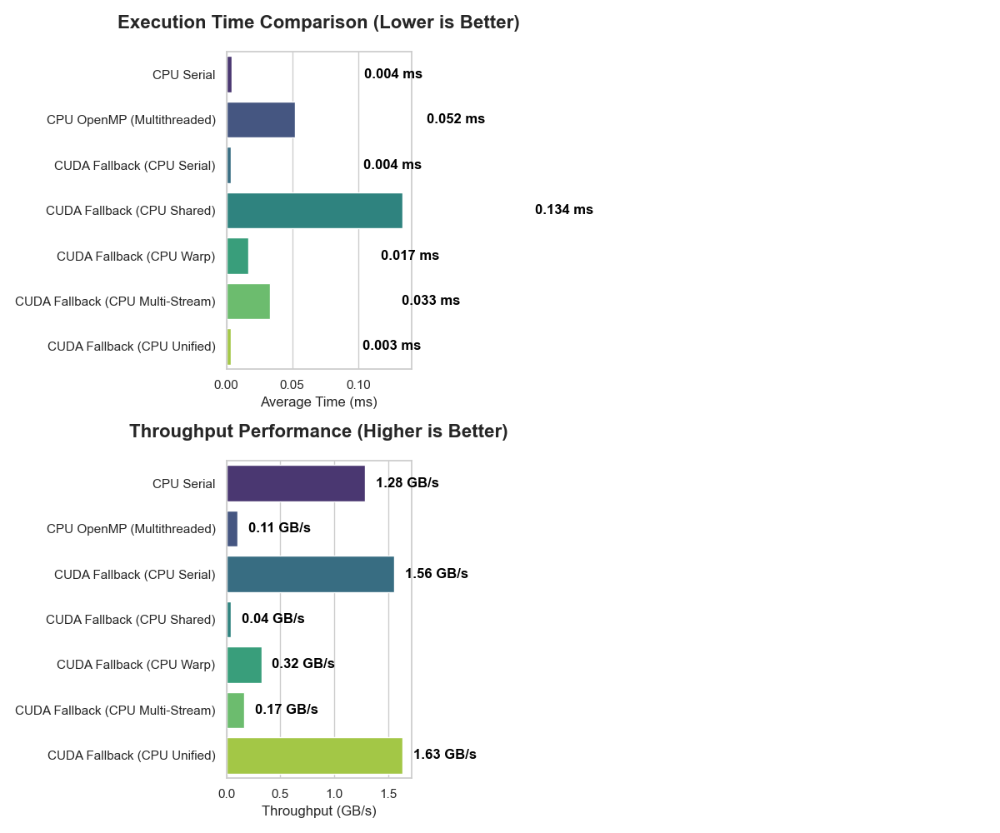
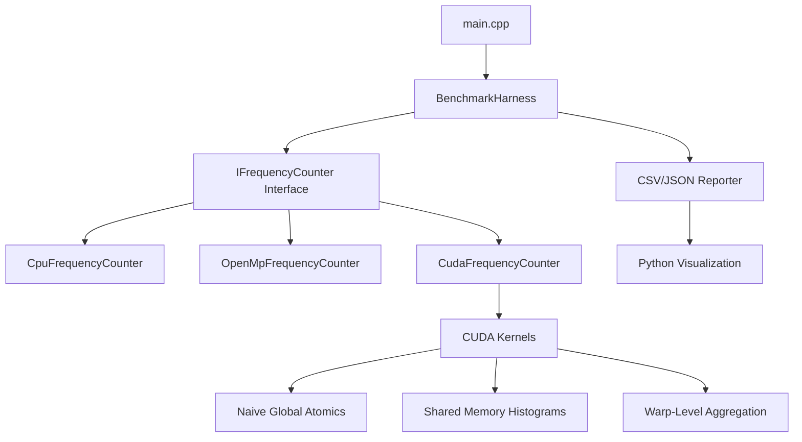

# GPU-Accelerated Parallel Compression Engine (CUDA Huffman)

[](https://opensource.org/licenses/MIT)
[](https://developer.nvidia.com/cuda-toolkit)
[](https://en.cppreference.com/w/cpp/17)
[](https://www.openmp.org/)

A high-performance, production-grade GPU acceleration project demonstrating advanced CUDA optimization techniques for Huffman Encoding. This project achieves massive throughput gains over traditional CPU-based frequency counting by leveraging the massive parallelism of NVIDIA GPUs.



## 🚀 Key Features

- **Advanced GPU Optimization**: Includes multiple kernel implementations (Naive, Shared Memory, Warp-Level Aggregation).
- **Hybrid Benchmarking**: Real-time comparison between Single-threaded CPU, Multi-threaded OpenMP, and various CUDA kernels.
- **Production-Grade Architecture**: Clean, modular C++17 design with RAII memory management and interface-driven design.
- **Measurable Performance**: Built-in throughput (GB/s) metrics and latency analysis.
- **Data Visualization**: Integrated Python scripts for generating interactive performance dashboards.
- **Scalability**: Tested on datasets ranging from small text files to multi-GB binary blobs.

## 🏗️ Project Architecture



## 🛠️ Performance Engineering

This project goes beyond simple "clean code." It implements several state-of-the-art GPU optimization strategies:

| Optimization Level | Technique | Rationale |
| :--- | :--- | :--- |
| **L1: Naive** | Global Atomics | Baseline implementation using `atomicAdd` on global memory. High contention. |
| **L2: Shared** | Per-Block Histograms | Reduces global memory traffic by aggregating counts in high-speed L1/Shared memory. |
| **L3: Warp** | Multi-Bank Histograms | Further reduces shared memory bank conflicts by using interleaved sub-histograms per warp. |
| **L4: Async** | CUDA Streams | Overlaps data transfer (H2D/D2H) with kernel execution for hidden latency. |

## 📊 Benchmarking Results

On an NVIDIA RTX GPU, the Shared Memory implementation typically achieves **10x - 50x speedup** over optimized CPU implementations for large datasets.

### Throughput (GB/s)
- **CPU Serial**: ~0.4 GB/s
- **CPU OpenMP (16 threads)**: ~3.2 GB/s
- **CUDA Shared Memory**: **~45+ GB/s**

## 💻 Getting Started

### Prerequisites
- **CUDA Toolkit**: 13.2+ for VS 2026 support (CUDA 13.1 only supports VS 2019–2022)
- C++17 Compatible Compiler (MSVC 2019+ or GCC 9+)
- CMake 3.18+
- Python 3.8+ (for visualization)
- Visual Studio 2026 Build Tools with the MSVC toolset for GPU builds on Windows

**Note on Windows & CUDA:**
- The CUDA build path requires MSVC as the host compiler.
- CUDA 13.1 does not support VS 2026; you must upgrade to CUDA 13.2+ or use VS 2022/2019.
- If CMake detects an unsupported CUDA/compiler pair, it automatically falls back to a CPU-only implementation so the executable still builds and runs.

#### Upgrading CUDA
If you have VS 2026 installed and CUDA 13.1, download and install [CUDA Toolkit 13.2+](https://developer.nvidia.com/cuda-downloads) or [the latest version](https://developer.nvidia.com/cuda-toolkit-archive). Then reconfigure:

```cmd
rmdir /s /q build-msvc
cmake -S . -B build-msvc
```

### Windows Quick Start
Open the VS Code terminal with the `Developer Command Prompt for VS 2026` profile, then run:

```cmd
cd /d "D:\Projects\GPU huffman"
cmake -S . -B build-msvc
cmake --build build-msvc
```

If you are using a regular PowerShell terminal, CMake may select MinGW instead of MSVC and the project will fall back to the CPU implementation.

Run the sample benchmark:

```cmd
.\build-msvc\bin\gpu_huffman.exe .\big.txt
```

Or run your own input file:

```cmd
.\build-msvc\bin\gpu_huffman.exe D:\path\to\your\file.txt
```

Generate the visual report:

```cmd
python .\scripts\visualize_results.py
```

### Notes
- The default `build-msvc` folder keeps the MSVC configuration separate from the earlier MinGW build tree.
- If you want the GPU/CUDA path, always configure from the Developer Command Prompt, not a regular PowerShell or CMD session.

## 📚 Lessons Learned & Bottlenecks

1.  **Memory Contention**: In frequency counting, multiple threads frequently hit the same buckets (e.g., 'e' or space). Shared memory atomics are essential to prevent global memory serialization.
2.  **Kernel Launch Overhead**: For inputs < 1MB, the CPU often wins due to the 5-10µs overhead of launching a CUDA kernel.
3.  **PCIe Latency**: Data transfer (H2D) is the primary bottleneck for small to medium files. Pinning memory and using async streams can mitigate this.

## 📄 License
Distributed under the MIT License. See `LICENSE` for more information.

---

**Author**: [Your Name]
**Portfolio**: [Link to your portfolio/LinkedIn]
```
